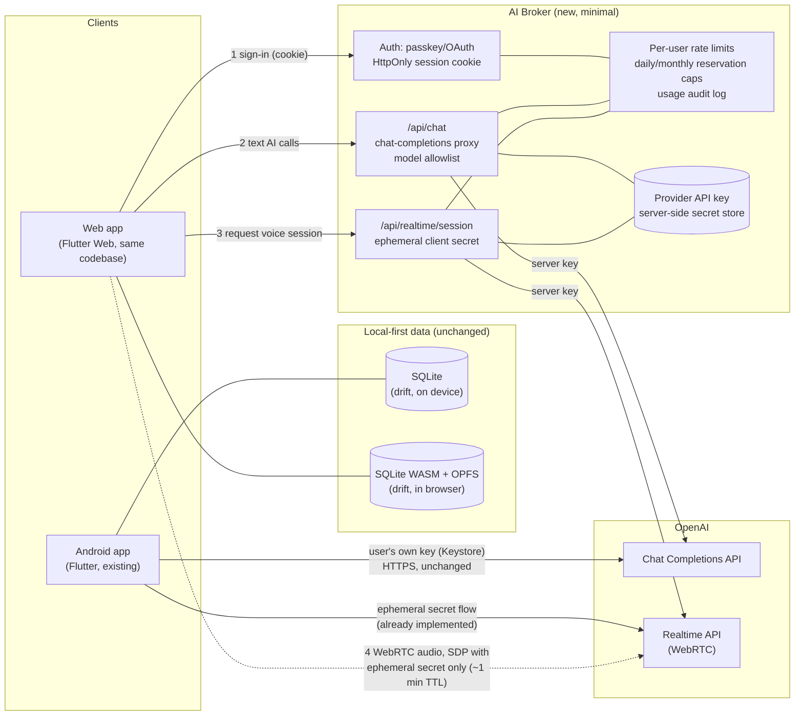
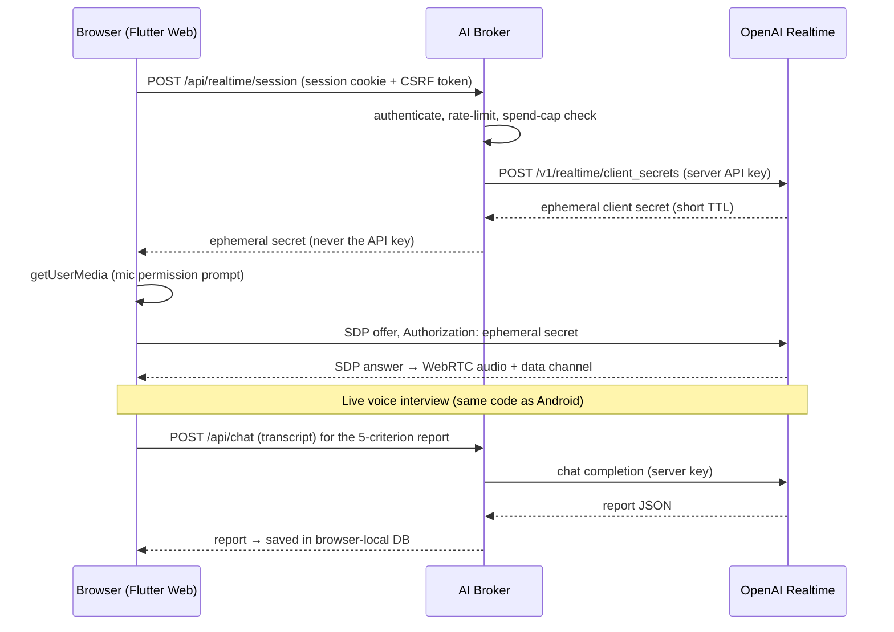

# P4 — SLE Prep on the Web: Implementation Plan

**Goal:** Serve the existing app as a web session usable anywhere on the internet, gated by sign-in, with the same features as Android (including the Realtime voice interview) — without introducing the vulnerabilities a naive port would create.

**Status (2026-07-13):** P4-1 through P4-4 and hardening changes are implemented
in the repository. Automated checks are defined in CI; use its latest run for
current pass/fail evidence rather than older fixed test totals in this plan.
The final Render service/domain, Google OAuth/passkey flow, paid-provider smoke
test, clean-profile offline/PWA check, device audio check, and external header
scan require owner-managed production credentials or infrastructure.

---

## 1. Why the security model must change

On Android, the user's OpenAI API key lives in hardware-backed encrypted storage on a device they own, and every AI call goes directly from the app to the provider. That trust model **does not transfer to a browser**:

- A browser has no equivalent of Android Keystore. A key kept in `localStorage`/IndexedDB is one XSS or malicious-extension away from exfiltration, and it is sent from a JavaScript-readable context on every call.
- A public URL is reachable by everyone; without an auth gate, anyone could burn the API budget.
- Long-lived credentials must therefore never reach the browser. The browser gets only **short-lived, scope-limited tokens**, minted server-side after authentication.

This drives the one new component of P4: a minimal backend, the **AI Broker**.

## 2. Architecture

The Android app keeps its current direct-to-provider model (the user's own key on their own device). The web app never sees a long-lived key: text calls go through the broker, and the Realtime interview uses the same ephemeral-secret pattern the Android app already implements — except the secret is minted by the broker instead of by the client.

### Realtime voice flow on the web (sequence)

## 3. Component decisions

| Decision | Choice | Rationale |
|---|---|---|
| Web client | **Flutter Web from the same codebase** | drift (SQLite WASM/OPFS), flutter_webrtc, speech_to_text, and flutter_tts all support web; one codebase, one test suite |
| Local data on web | **drift WASM + OPFS**, local-first as on Android, partitioned by opaque broker user ID | keeps the privacy model ("your data stays with you"), prevents two allowed accounts on one browser from sharing study data, and stores no study data server-side |
| Backend | **One small service** (FastAPI on Render — already familiar from other projects — or a Cloudflare Worker) | three endpoints + auth; deliberately too small to accumulate vulnerabilities |
| Auth ("the permission") | **Passkey (WebAuthn) primary, Google OAuth fallback; allowlist of approved emails** (initially one) | phishing-resistant, no password database to breach; the allowlist is the permission gate |
| Session | HttpOnly, Secure, SameSite=Strict cookie + CSRF token on mutating routes | tokens invisible to JS → XSS cannot steal a session |
| Key custody | Provider key only in the broker's secret store (env/secret manager), encrypted at rest | browser compromise cannot leak it |
| Abuse control | Per-user/global rate limits, daily + monthly reservation caps, model allowlist, audit log, plus provider-side project limits | bounds broker-authorized work; the provider limit is still needed because direct Realtime WebRTC usage cannot be settled by the broker |
| AI access in app code | New `AiGateway` interface: `DirectProviderGateway` (mobile, current behaviour) and `BrokerGateway` (web) chosen by platform | zero behaviour change on Android; the UI code stays identical |

## 4. Threat model (what could go wrong → what stops it)

| Threat | Mitigation |
|---|---|
| API-key theft from the browser | Key never sent to the browser; only ephemeral Realtime secrets (~1 min TTL) and cookie-authenticated proxy calls |
| XSS | Strict CSP (`default-src 'self'`; `connect-src` limited to self + `api.openai.com`; no third-party scripts), Flutter Web renders via canvas (minimal DOM injection surface), HttpOnly cookies |
| CSRF | SameSite=Strict cookies + per-session CSRF token on all POSTs |
| Session hijack / MITM | TLS everywhere, HSTS preload, Secure/HttpOnly cookies, and a bounded session lifetime |
| Unauthorized use of the public URL | WebAuthn/OAuth sign-in with an email allowlist; unauthenticated requests never reach OpenAI |
| Cost abuse (stolen session, runaway loop) | Rate limits + atomic daily/monthly reservation caps in the broker; usage audit log; provider-side project limits/alerts. Text settles from returned usage, while direct Realtime media has only a conservative fixed reservation, not a guaranteed actual-spend cap |
| Ephemeral-token replay | Short TTL, single-session scope (OpenAI-enforced), minted only after auth + limits check |
| Supply chain | Locked dependencies (`pubspec.lock`, `uv.lock`/`package-lock`), Dependabot/`pub outdated` cadence, no third-party JS on the page |
| DoS | Bounded in-process auth/AI limiters and a small API surface; configure an additional edge limit at the production host |
| Privacy | Study data stays in the browser (OPFS); broker persists auth/usage metadata but not request content; transcripts pass through without being stored and logs contain route/status/latency rather than content |

## 5. Task breakdown

### P4-1: Platform abstraction + web target boots (offline features)
**Complete.**
- Introduce `AiGateway` in `lib/domain/llm/` with `DirectProviderGateway` wrapping the existing `clientFor`; UI call sites switch to the gateway (pure refactor, tests unchanged).
- Conditional storage: `flutter_secure_storage` on mobile; on web the settings screen hides key entry entirely (broker mode).
- CI builds Flutter Web with drift WASM setup (`sqlite3.wasm` +
  `drift_worker.js` assets); COOP/COEP headers are configured for OPFS.
- A versioned application-shell service worker caches bundled practice assets,
  never `/api/*` or `/auth/*`. An opaque offline profile hint expires after
  seven days. The earlier unpartitioned database is deliberately not
  auto-attached to a user and needs a future explicit migration/export path.
- Exit: vocab, drills, reading, and the session planner work against the
  per-user OPFS database. A clean-profile online-then-offline browser smoke test
  remains a manual release gate in the security checklist.

### P4-2: AI Broker
**Complete in code.** Broker coverage is maintained by the test suite; use the
current test command/CI result rather than the historical count previously
recorded here.
- FastAPI (or Worker) with: WebAuthn/OAuth sign-in, session cookies, CSRF; `POST /api/chat`; `POST /api/realtime/session`; rate limits + reservation caps; structured audit log.
- Secrets via the platform's secret manager; no key in code or logs.
- Tests: auth required on every AI route, allowlist enforcement, cap enforcement, proxy passthrough with model allowlist.
- Exit: curl cannot reach OpenAI through the broker without a valid session; caps demonstrably block over-use.

### P4-3: Web AI features
**Complete in code.** CI is configured to run Flutter analysis/tests and the
production web build. Live paid-provider and browser/device validation remains
a post-deploy smoke check.
- `BrokerGateway` implementation (cookie auth, CSRF header) for drills/reading/writing/oral-report calls.
- Realtime on web: reuse `OpenAiRealtimeVoiceSession` with the ephemeral secret fetched from the broker (small seam in `OpenAiRealtimeApi`: `createClientSecret` becomes gateway-provided).
- Web speech fallbacks (daily question): `speech_to_text`/`flutter_tts` web implementations; feature-detect and hide gracefully where unsupported.
- Exit: full parity demo in Chrome — sign in, generate drills, do a reading set,
  hear the attached Realtime remote audio track, complete an interview, allow
  the final-transcript grace period, and save the five-dimension report. This
  remains unchecked until run against the owner's deployed credentials/device.

### P4-4: Hardening + deploy
**Implemented in the repository; deployment validation pending owner secrets.**
- Security headers (CSP, HSTS, COOP/COEP, X-Content-Type-Options, Referrer-Policy) verified by an automated check; OWASP ASVS-L1 style checklist pass.
- Deploy: static web build to CDN/host + broker to Render/Cloudflare; custom domain + TLS.
- Exit: headers scan clean; checklist archived in `docs/`; app reachable at the public URL, gated by sign-in.

### P4-5: Docs
**Complete.** See the root README, broker README, PRD §14, and security checklist.
- README web section (build, deploy, broker configuration); PRD status update.

## 6. Explicitly out of scope for P4

- Cross-device sync of study data. Encrypted export/import is the intended
  future bridge but is not implemented in this P4 release.
- Multi-tenant accounts beyond the allowlist; monetization.
- Serving other users' provider keys (the broker uses one owner-configured key).

## 7. Verification

1. Auth: unauthenticated and non-allowlisted requests to every `/api/*` route → 401/403; page loads but AI features locked.
2. Secrets: browser devtools network audit — no request ever contains the provider key; Realtime SDP uses only ephemeral tokens.
3. Headers: run automated middleware assertions in CI, then run Mozilla
   Observatory against the deployed HTTPS origin and archive the report.
4. Caps: scripted burst exceeds the per-minute limit → 429; simulated daily
   reservation cap → AI routes disabled with a clear French message. Separately
   verify the OpenAI project budget/alert because Realtime media bypasses broker
   usage settlement.
5. End-to-end: passkey sign-in → drill generation → timed reading → audible
   Realtime interview → final-transcript grace → saved report, in a clean
   browser profile.
6. Offline: after one authenticated load and service-worker activation, disable
   the network and reload seeded practice from the per-user OPFS database;
   separately verify that API/auth requests are absent from Cache Storage.
